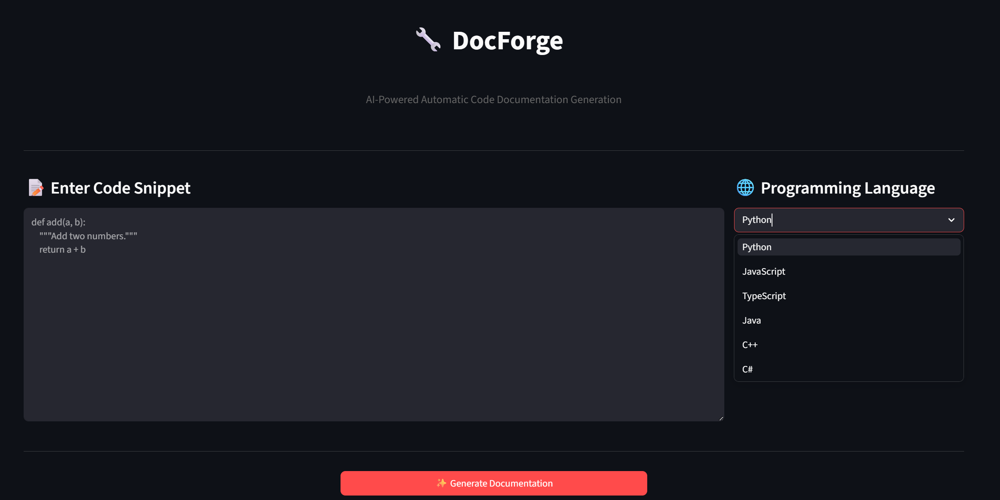
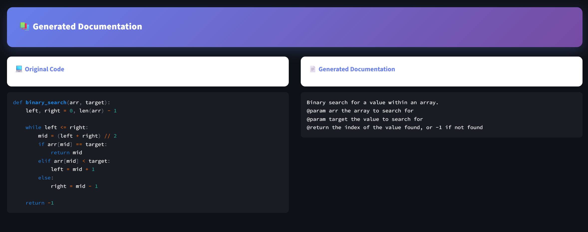
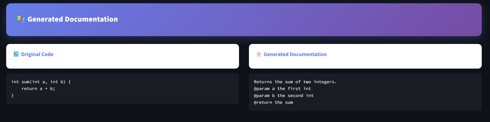

# DocForge

**AI-Powered Automatic Code Documentation Generation**

---

## Overview

High-quality documentation is the backbone of maintainable software, yet it remains one of the most neglected aspects of development. DocForge bridges the gap between code and comprehension by automatically generating clear, complete documentation for functions using fine-tuned transformer models.

Given a function, DocForge generates:
- A natural language description of what the function does
- Parameter explanations (`@param`)
- Return value descriptions (`@return`)

---

## Results

| Model | BLEU | ROUGE-L |
|---|---|---|
| Paper: Zero-shot Llama 3.1 8B | 0.0302 | 0.0786 |
| Paper: Fine-tuned Llama 3.1 8B | 0.0391 | 0.0975 |
| **Ours: CodeT5-base (Run 1)** | **0.2691** | **0.4621** |
| **Ours: CodeT5-base (Run 2)** | **0.2866** | **0.4686** |

Our fine-tuned CodeT5-base outperforms the paper's fine-tuned Llama 3.1 8B by **7.3x on BLEU**, despite being 36x smaller.

---

## Dataset

We use the [Code2Doc dataset](https://huggingface.co/datasets/kaanrkaraman/code2doc) (arXiv:2512.18748) — a curated benchmark of 13,358 high-quality function-documentation pairs across Python, Java, TypeScript, JavaScript, and C++.

Each sample contains:
- `codet5_input` — prompt in the format `Summarize {language}: {code}`
- `codet5_target` — the target docstring

---

## Model

We fine-tune **[Salesforce/codet5-base](https://huggingface.co/Salesforce/codet5-base)** — an encoder-decoder transformer pre-trained on code.

**Why CodeT5 over Llama?**
- CodeT5 is an encoder-decoder — encoder reads code deeply, decoder generates docs
- Pre-trained specifically on code understanding and generation tasks
- 222M parameters vs 8B — 36x smaller, 7.3x better results
- Domain-specific pretraining beats raw model scale

## Interactive Dashboard






---

## Training Configuration

| Setting | Run 1 | Run 2 |
|---|---|---|
| Epochs | 3 | 5 |
| Learning Rate | 5e-5 | 3e-5 |
| Warmup Steps | 200 | 300 |
| Effective Batch Size | 16 | 16 |
| Hardware | NVIDIA T4 | NVIDIA T4 |
| BLEU | 0.2691 | 0.2866 |
| ROUGE-L | 0.4621 | 0.4686 |

---

## Pretrained Model on Hugging Face

The fine-tuned DocForge model is hosted on Hugging Face Hub for easy access and deployment:

**Model:** [`ufoblivr/docforge-codet5-base-v1`](https://huggingface.co/ufoblivr/docforge-codet5-base-v1)

### Loading the Model

The model is automatically downloaded and cached when you run the dashboard:

```python
from transformers import AutoTokenizer, AutoModelForSeq2SeqLM

MODEL_NAME = "ufoblivr/docforge-codet5-base-v1"
tokenizer = AutoTokenizer.from_pretrained(MODEL_NAME)
model = AutoModelForSeq2SeqLM.from_pretrained(MODEL_NAME)
```

The model is cached locally, so subsequent runs load instantly.

---

## Repository Structure

```
DocForge/
├── dashboard.py                    # Streamlit web interface for documentation generation
├── requirements.txt                # Python package dependencies
├── README.md                       # Project documentation
├── app/                            # Application modules
├── notebooks/                      # Jupyter notebooks
│   ├── docforge-codet5-model.ipynb # Model training & evaluation
│   ├── eda-docforge.ipynb          # Dataset exploration & analysis
│   └── preprocessing-docforge.ipynb # Data preprocessing pipeline
└── .gitignore
```

---

## Getting Started

### Prerequisites
- Python 3.8+
- pip or conda

### Installation

1. **Clone the repository:**
   ```bash
   git clone <https://github.com/ufoblivr/doc-forge.git>
   cd DocForge
   ```

2. **Install dependencies:**
   ```bash
   pip install -r requirements.txt
   ```

### Running the Dashboard

Launch the interactive Streamlit dashboard to generate documentation for your code:

```bash
streamlit run dashboard.py
```

The dashboard will open in your browser at `http://localhost:8501`

**Features:**
- Paste or type code snippets
- Get instant AI-generated documentation
- View parameter and return value descriptions

### Using Jupyter Notebooks

Explore the project step-by-step:

```bash
jupyter notebook notebooks/
```

- `eda-docforge.ipynb` - Dataset exploration and statistics
- `preprocessing-docforge.ipynb` - Data cleaning and preprocessing
- `docforge-codet5-model.ipynb` - Model training and evaluation

---

## Technologies

- Python
- PyTorch
- Hugging Face Transformers
- Datasets
- Evaluate (BLEU, ROUGE)
- Streamlit

---

## References

- Karaman, R.K. & Akarsu, M. (2025). [Code2Doc: A Quality-First Curated Dataset for Code Documentation](https://arxiv.org/abs/2512.18748). arXiv:2512.18748
- Wang, Y. et al. (2021). [CodeT5: Identifier-aware Unified Pre-trained Encoder-Decoder Models](https://arxiv.org/abs/2109.00859). EMNLP 2021
- Vaswani, A. et al. (2017). Attention Is All You Need. NeurIPS 2017
